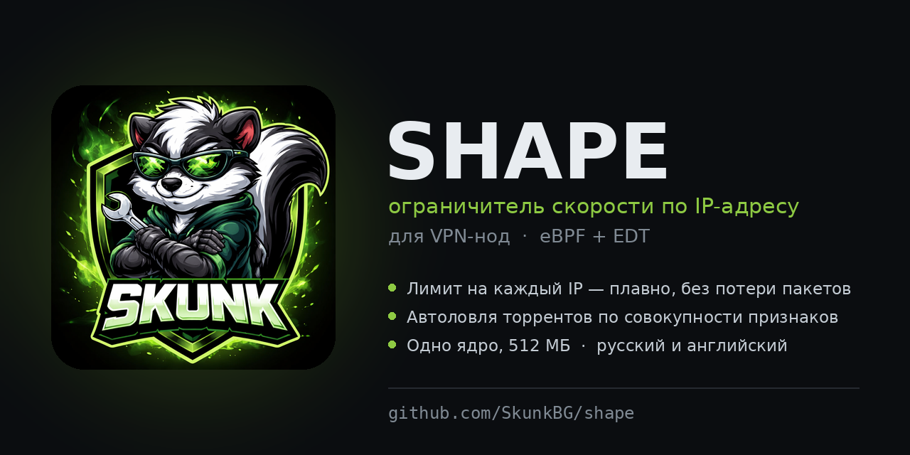

<p align="center">
  
</p>

<p align="center">
  <a href="#установка"></a>
  
  
  
</p>

<p align="center">
  <b>Русский</b> · <a href="README.en.md">English</a>
</p>

# Shape v3.9

Ограничитель скорости по IP-адресу для VPN-нод. eBPF + EDT.

Интерфейс на русском и английском — язык спрашивается при первом запуске,
меняется в меню: Сервис → 🌐 Язык / Language.

Одна настройка: **порт и скорость в Мбит/с**. Каждый IP-адрес получает свой
независимый лимит в обе стороны.

**Лимит считается по IP-адресу, а не по учётной записи.** Это важно понимать:
за одним адресом может сидеть вся семья через домашний роутер — лимит у них
будет общий. И наоборот, один человек с телефона и ноутбука на разных сетях
получит два независимых лимита. Панель про учётные записи знает, шейпер — нет,
он работает на сетевом уровне и видит только адреса.

История версий — в [CHANGELOG.md](CHANGELOG.md) ([English](CHANGELOG.en.md)).

Есть необязательный [API ноды](#api-ноды) для внешних систем — ставится отдельно, Shape работает и без него.

Ноль внешних зависимостей: Python из системы плюс `clang`,
`bpftool` и `iproute2`. Работает на одноядерной VPS с 512 МБ памяти.

---

## Установка

```bash
apt update && apt install -y git && \
git clone https://github.com/SkunkBG/shape.git /tmp/shape && \
bash /tmp/shape/install.sh && shaper
```

### Требования

| | |
|---|---|
| Ядро Linux | 5.4+ |
| Процессор | 1 ядро достаточно |
| Память | 512 МБ достаточно |
| Пакеты | `clang`, `bpftool`, `iproute2`, `python3` |

Установщик ставит зависимости сам на apt/dnf/yum. На Debian 11/12 и
Ubuntu 22.04/24.04 всё есть в стандартных репозиториях.

### Сколько потребляет

Обработка пакетов идёт в ядре и стоит несколько наносекунд на пакет — на
процессоре это не видно вообще, хоть на гигабите.

Заметная часть — сторож. Раз в 10 секунд он выгружает две BPF-карты и разбирает
JSON. Стоимость определяется размером карт, а не числом клиентов: карты типа LRU
набиваются до потолка и остаются полными.

| Записей в карте | JSON | Разбор за цикл |
|---|---|---|
| 8192 (по умолчанию) | 1.3 МБ | ~30 мс |
| 65536 | 10.6 МБ | ~300 мс |

Восемь тысяч записей — запас в двадцать раз: на ноду со 150 клиентами приходится
300–500 адресов в сутки даже с учётом смены мобильных IP.

Итого на одноядерном VPS сторож съедает меньше процента процессора, память —
около 25 МБ на Python плюс 2 МБ на BPF-карты.

**Если хочется ещё легче:** подними период опроса в настройках автоограничения
до 20–30 секунд. На качество детекта это почти не влияет, потому что пороги
считаются в замерах, а не в секундах.

## Обновление

`shaper` → **Сервис** → **Обновить из GitHub**. Меню покажет установленную и
доступную версии, список последних изменений и спросит подтверждение.

Настройки, белый список и лимит сохраняются. Перед обновлением текущая версия
копируется в `/opt/shaper.bak`; если новая не соберётся, установщик откатится
на неё автоматически.

Из командной строки то же самое:

```bash
rm -rf /tmp/shape && git clone https://github.com/SkunkBG/shape.git /tmp/shape
bash /tmp/shape/install.sh
```

Удаление: `bash install.sh --uninstall`.

---

## Как пользоваться

```
shaper
```

<p align="center">
  
</p>

```
  ⚡ Shape · ограничитель скорости по IP-адресу
  ────────────────────────────────────────────────────────────
  🟢  Шейпер     работает   интерфейс ens3
  🔁  Автостарт  включён    переживёт перезагрузку сервера
  🚀  Скорость   15 Мбит/с  на каждый IP-адрес
  🔌  Порт       443
  ────────────────────────────────────────────────────────────

  [1] 🎚  Настроить лимит — скорость и порт
  [2] 🚦 Автоограничение — ловить качальщиков
  [3] 📡 Монитор — кто грузит канал прямо сейчас
  [4] 📊 Статистика — сколько прокачали всего
  [6] 🚫 Ограниченные (2)
  [7] 🤍 Белый список IP
  [8] 🔧 Сервис — запуск, автостарт, логи, обновление
  [0] 🚪 Выход
```

Первый экран отвечает на все вопросы сразу: работает ли шейпер, поднимется ли
он после перезагрузки сервера, какой стоит лимит и на каком порту. Если
автостарт слетел, строка станет жёлтой с предупреждением — после ребута
клиенты молча получили бы безлимит, и это легко не заметить.

Пункт «Настроить лимит» спрашивает скорость (10 / 15 / 20 Мбит/с, своё
значение или «снять ограничение») и порт. Всё.

### Монитор

Обновляется каждые 2 секунды и показывает, кто занимает канал прямо сейчас:

```
  Монитор                                     обновление 2 с · Ctrl+C — выход
  ────────────────────────────────────────────────────────────────────────────
   Канал сейчас    ↓   54.1   ↑  10.4 Mbit/s   ▂▃▄▅▅▆▇█████  за минуту
   Лимит на адрес  10 Mbit/s   на каждый IP      нагружают канал 58 из 377
  ────────────────────────────────────────────────────────────────────────────
   IP                     сейчас   отдача    средн  держит  доля лимита
 ▪ 109.248.47.99            10.1      0.1      3.1  12 мин  ████████████ 101%
 ▪ 91.78.0.72                9.8      0.2      9.6  44 мин  ███████████▉  98%
   91.79.7.124               6.4      0.2      1.1       —  ███████▊····  64%
 ✓ 203.0.113.40              5.1      0.4      4.8   5 мин  ██████▏·····  51%
   91.79.15.94               1.4      2.7      1.7       —  █▊··········  14%
 ⊘ 89.253.46.46              1.0      0.0      4.3       —  █▎··········  10%
  ────────────────────────────────────────────────────────────────────────────
   показано 20 из 68   ▪ держит больше 30 с   ✓ белый список   ⊘ ограничен
```

Колонка **мин.средн** — средняя скорость примерно за последнюю минуту. Она и
отличает постоянную нагрузку от всплеска: если «сейчас» и «среднее» близки,
человек качает ровно и долго, а если среднее заметно ниже — это разовый рывок.

**Цвет строки — доля от лимита:** серый до 20%, зелёный до половины, жёлтый
до 80%, красный выше. Колонка отдачи красится по своей шкале: у мобильных
операторов канал вверх узкий, и заметная отдача — первый признак раздачи.
В примере выше 91.79.15.94 качает всего 1.4 Мбит/с, но отдаёт 2.7 — именно
так выглядит торрент.

Колонка **средн** — средняя скорость примерно за минуту, **держит** — сколько
времени подряд адрес идёт выше половины лимита. Вместе они отличают ровную
многочасовую нагрузку от короткого рывка.

**Значок слева:** ▪ адрес держит нагрузку дольше 30 секунд, ✓ адрес в белом
списке, ⊘ адрес уже ограничен. Спарклайн в шапке — канал за последнюю минуту.

Адреса из белого списка видны наравне с остальными: лимит к ним не
применяется, но нагрузку они создают такую же, и знать о ней надо. Раньше
их не было видно вообще нигде.

Выход — Ctrl+C.

Лимит применяется сразу, без перезапуска сервиса и без разрыва соединений.
Настройки переживают перезагрузку сервера.

---

## Автоограничение качальщиков

Общий лимит не спасает от торрентов: человек просто держит свои 10 Мбит/с
круглосуточно. Сторож ловит именно это.

Раз в 10 секунд он замеряет каждый IP и решает по совокупности признаков, а не
по одному порогу. Всё настраивается в меню: 🚦 Автоограничение.

### Обязательное условие

**Трафик в обе стороны одновременно** — вниз не меньше половины лимита, вверх
не меньше 15% от него, десять минут подряд. Без этого штраф не выдаётся вообще,
каким бы тяжёлым трафик ни был.

Условие держится на простом наблюдении: торрент — единственное бытовое занятие,
которое часами тянет данные вниз и вверх сразу. Стриминг молчит вверх, облачный
бэкап молчит вниз, скачивание файла молчит вверх — все они не проходят проверку
и не наказываются никогда.

Пороги разные не случайно. Торрент забирает **всё** доступное скачивание, а
видеозвонок держит скромные 2–3 Мбит/с — по этому и различаются. Верхний порог
низкий, потому что у мобильных операторов отдача всего 3–20 Мбит/с, и при
лимите в 10 сидирование даёт лишь треть канала.

### Баллы

| Признак | Балл |
|---|---|
| Крупные пакеты в отдаче (>600 Б) | +2 |
| Держит потолок скачивания | +1 |
| Больше 4 часов активности за сутки | +2 |
| Больше 2 ГБ отдано за сутки | +1 |

Штраф при трёх баллах.

Главный признак — **средний размер пакета в отдаче**, и он единственный не
зависит от скорости канала. Клиент, который только потребляет, шлёт вверх голые
ACK'и по 40–80 байт. Клиент, который раздаёт, шлёт данные по 1200–1400. Разница
в двадцать раз одинакова и на 3 Мбит, и на 20.

### Проверено симуляцией

| Сценарий | Результат |
|---|---|
| YouTube 1080p на телефоне | чисто |
| YouTube 4K на телевизоре | чисто |
| Видеоконференция 3 часа | чисто |
| Бэкап в облако | чисто |
| Скачивание ISO 5 ГБ | чисто |
| Онлайн-игра | чисто |
| Торрент при аплинке 3, 5, 10, 20 Мбит | штраф через 10 мин |
| Торрент с паузами | штраф через 23 мин |

### Объёмные пороги

Двусторонняя нагрузка ловит торрент с раздачей. Но клиент с выключенной
раздачей отдаёт лишь запросы блоков и обязательное условие не проходит — а это
честно: **торрент без раздачи с точки зрения сети неотличим от обычной тяжёлой
закачки.** Никакой признак его не выдаст, потому что выдавать нечего.

Выдаёт объём. Два независимых порога, оба в обход обязательного условия.

**За час** — самый быстрый признак. При лимите 10 Мбит/с час на полной скорости
даёт ровно 4.5 ГБ, поэтому порог около трёх означает «держал канал две трети
часа». Закачка упирается в него за 40 минут.

**За сутки** — страховка от того, кто размазывает нагрузку тонким слоем.

Оба настраиваются в меню, `0` выключает. По умолчанию часовой выключен,
суточный — 50 ГБ.

### Почему час важнее суток

Суточный порог наказывает по времени, часовой — по интенсивности. Десять часов
Ютуба в 1080p это 18 ГБ: любой суточный лимит ниже двадцати накажет человека,
который ни разу не превысил разумную скорость.

Часовой этой проблемы лишён. Битрейт 1080p — 1.8 ГБ/час, вдвое ниже порога в
три гигабайта, и смотреть можно хоть сутки.

Поэтому основным правилом стоит делать часовой, а суточный держать высоко —
только как страховку.

### Пресеты

Меню → Автоограничение → **[12] Готовые пресеты**. Расставляют все числа сразу,
после чего любой пункт можно поправить вручную.

**Нода под мобильные телефоны** — 3 ГБ в час, 25 ГБ в сутки, штраф 1 Мбит/с на
4 часа. Смоделировано по минутам на сутках:

| Сценарий | За сутки | Штрафов |
|---|---|---|
| YouTube 1080p, 10 часов подряд | 18.0 ГБ | 0 |
| YouTube 720p, весь день | 16.9 ГБ | 0 |
| TikTok весь день | 13.5 ГБ | 0 |
| YouTube 4K два часа | 7.2 ГБ | 1 |
| Обновление игры 3 часа | 6.5 ГБ | 1 |
| Качает круглосуточно | 25.7 ГБ | 6 |

Без ограничений последний за те же сутки взял бы 108 ГБ.

**Универсальная** — 50 ГБ в сутки, часовой выключен. Для нод с большим трафиком.

**Только торренты** — объёмные пороги выключены, работает лишь двусторонняя
нагрузка. Для безлимитных каналов.

### Расшифровка

В списке ограниченных видно, за какие признаки человек попал:

```
  IP                             с    осталось   за что
  ────────────────────────────────────────────────────────────
  91.79.27.87                20:48      11.1 ч   выкачал гигабайты за час
  185.12.34.56               20:33      46 мин   отдаёт данные, а не
                                                 подтверждения, держит потолок
```

Свежие сверху, время выдачи штрафа в колонке «с».

Помогает крутить пороги и отвечать клиентам предметно. Ограниченные видны
отдельным пунктом меню со счётчиком, снять можно поимённо или всех сразу.
Штрафы переживают перезапуск сервиса и перезагрузку сервера.

---

## Что это умеет и чего не умеет

**Не умеет** отличать торрент от чего-либо ещё. Внутри VLESS/Reality на 443
весь трафик — один зашифрованный TLS-поток: ни BitTorrent-хендшейка, ни портов
трекеров там не видно. Никакой L3/L4-инструмент этого не увидит в принципе.

**Умеет** ровно то, что нужно: держать честный потолок скорости на каждого
пользователя, чтобы один качальщик не забирал канал у остальных. Скачивает он
образ Windows или смотрит YouTube — неважно, потолок один и тот же.

---

## Как это устроено

```
Пакет на интерфейсе
   │
   ├─ лимит задан?        нет ──► пропустить
   ├─ IP в белом списке?  да  ──► пропустить
   ├─ порт в списке?      нет ──► пропустить
   │
   ├─ Download (egress) : EDT — пакету назначается время отправки,
   │                      fq придерживает его. Ничего не теряется.
   └─ Upload  (ingress) : Token Bucket — лишние пакеты дропаются,
                          TCP сам уменьшает окно.
```

EDT (Earliest Departure Time) вместо классических очередей означает, что
скорость режется плавно: пакеты не выбрасываются, а равномерно распределяются
во времени. Для видео и звонков это заметно приятнее, чем дроп.

Порт матчится строго по направлению: на download сравнивается только `sport`,
на upload — только `dport`. Иначе под лимит «443» попал бы ещё и исходящий
трафик самой ноды к чужим сайтам, где `dport=443`.

Порт `0` означает «все порты». Под него попадёт и SSH, и служебный трафик ноды,
так что без нужды его лучше не ставить.

Карты состояний имеют тип LRU: упёрлись в 65536 адресов — ядро само вытесняет
давно неактивные. Фоновая чистка не нужна.

---

## Единицы

Скорость везде в **Мбит/с** (мегабитах в секунду), как её пишут провайдеры.
Внутри eBPF хранится в байтах в секунду — это нужно для арифметики EDT.
Пересчёт: `байт/с = Мбит/с × 125000`, мегабит десятичный.

Ориентиры: звонок — 4 Мбит/с, YouTube 1080p — 10, 4K — 25.

Лимит действует на каждый IP-адрес отдельно. Пятьдесят человек по
15 Мбит/с — это до 750 Мбит/с на канал, если все качают одновременно.

---

## CLI

```bash
shaperctl.py show                          # текущие настройки
shaperctl.py apply --ports 443 --speed 15  # задать лимит
shaperctl.py apply --speed 0               # снять ограничение
shaperctl.py apply --ports 443,8443        # сменить только порты

shaperctl.py monitor                       # живой монитор нагрузки
shaperctl.py monitor --interval 5          # обновлять реже

shaperctl.py status                        # накопленный трафик по IP
shaperctl.py status --live                 # + текущая скорость за 3 с
shaperctl.py status --full                 # все IP
shaperctl.py status --json                 # для своих скриптов

shaperctl.py whitelist add 203.0.113.10
shaperctl.py whitelist list

shaperctl.py guard --enable --score 3 --both-min 10
shaperctl.py guard --both-dl 50 --both-ul 15 --packet 600
shaperctl.py guard --hours 4 --upload-gb 2 --penalty-mbps 1 --penalty-min 60
shaperctl.py guard --disable
shaperctl.py limited                       # кто сейчас ограничен
shaperctl.py release 185.12.34.56          # снять с одного
shaperctl.py release --all                 # снять со всех

shaperctl.py export --out /root/node.json  # резервная копия состояния
shaperctl.py export --out /root/node.json --with-secrets   # вместе с токеном
shaperctl.py import /root/node.json --dry-run              # что изменится
shaperctl.py import /root/node.json                        # восстановить
shaperctl.py import /root/node.json --only whitelist,owners

shaperctl.py telegram backup                # отправить копию в Telegram сейчас
shaperctl.py telegram set --backup on --backup-day 1
shaperctl.py telegram set --backup-thread 777
```

Формат `status --json`:

```json
{
  "ip": "185.12.34.56",
  "downloaded_bytes": 5368709120,
  "uploaded_bytes": 419430400,
  "download_mbps": 14.8,
  "upload_mbps": 1.2,
  "idle_sec": 0.4
}
```

---

## Проверка

```bash
shaper                              # → Сервис → Проверить окружение
tc filter show dev ens3 egress      # должен быть виден bpf-фильтр
shaperctl.py status --live          # реальные скорости по IP
```

Пусто в статистике при живых клиентах — лимит висит не на том порту. Смотри,
что реально слушают процессы: `ss -tulnp`.

---

## Уведомления в Telegram

По умолчанию выключены. Настраиваются в меню, пункт **[5] Telegram**.

Шлют **события, а не отчёты**. Ограничили адрес — одно сообщение с причиной.
Раз в сутки — сводка за прошедший день. Получается 5–20 сообщений в день
вместо потока, который перестают читать через неделю.

```
🚦 RU Москва
Ограничен 185.12.34.56 → 1 Mbit/s на 4.0 ч
выкачал гигабайты за час
```

```
📊 RU Москва · сводка за 2026-08-11
Трафик: ↓ 352.1 ГБ · ↑ 31.4 ГБ
Адресов: 137

Больше всех скачали:
1. 185.12.34.56 — 24.8 ГБ
2. 91.234.12.7 — 19.2 ГБ
```

**Время сводки** задаётся в меню, пункт `[9]`, по умолчанию `09:00` по часам
ноды. Сводка всегда за прошедшие календарные сутки: в полночь срез счётчиков
откладывается в `/etc/shaper/digest.json` и ждёт назначенного часа. Если в этот
момент связи не было, попытки повторяются раз в пятнадцать минут в течение
суток, потом сводка отбрасывается — позавчерашние цифры уже не нужны.

**Сводку можно запросить вручную** пунктом `[10]`: придут цифры за текущие,
ещё не закрытые сутки. Работает даже при выключенных уведомлениях, лишь бы
были заданы токен и чат.

**Подпись ноды** задаётся вручную — например `RU Москва` или `DE Франкфурт`.
Все ноды могут писать в одну тему: по подписи видно, кто именно сработал.

**Темы форум-групп** поддерживаются через `message_thread_id`. ID темы —
последнее число в её ссылке. Оставь поле пустым, если тем нет.

**Прокси.** На российских нодах `api.telegram.org` режется по SNI: TCP
проходит, TLS обрывается. Укажи `socks5://логин:пароль@хост:1080` — SOCKS5
реализован прямо в скрипте, `PySocks` ставить не нужно. При `socks5://` имя
хоста резолвит прокси, так что подменённый DNS тоже перестаёт мешать.

**MTProto-прокси не подойдёт.** Ссылки вида `t.me/proxy?server=…&secret=…`
работают только для самого мессенджера: это протокол MTProto, а Bot API —
обычный HTTPS. Такую строку меню отклонит с объяснением. Нужен настоящий
SOCKS5 или HTTP-прокси на машине вне зоны блокировки.

### Мастер SSH-туннеля

Telegram → **[10] SSH-туннель для прокси**. Поднимает SOCKS через твою же
зарубежную ноду, нового софта почти не нужно.

Мастер спрашивает адрес ноды, порт, пользователя и локальный порт SOCKS.
Дальше сам: создаёт ключ, показывает публичную часть, предлагает скопировать её
на удалённую машину (спросит пароль) либо подождать, пока добавишь вручную.
Ставит `autossh`, пишет systemd-юнит с автоперезапуском, поднимает и проверяет
связь настоящим запросом к Bot API. При успехе прописывает
`socks5://127.0.0.1:1080` в настройки уведомлений.

Туннель переживает разрывы и перезагрузку сервера. Трафика — считанные
килобайты в сутки.

Проверить руками:

```bash
systemctl status shape-tunnel
curl -sS --socks5-hostname 127.0.0.1:1080 -o /dev/null \
  -w 'http=%{http_code}\n' https://api.telegram.org/bot0:0/getMe
```

`http=401` — успех: связь есть, просто токен `0:0` заведомо липовый.

Токен лежит в `config.json`, файл автоматически получает права `600`.

Из командной строки:

```bash
shaperctl.py telegram set --token 123:AA… --chat -1001234567890 \
    --thread 45 --name "RU Москва" --proxy socks5://127.0.0.1:1080 --enable
shaperctl.py telegram test
shaperctl.py telegram show
```

---

## Ограничения

| | |
|---|---|
| Ядро | 5.4+ |
| Портов в списке | 64 |
| Отслеживаемых IP | 65 536 на направление (LRU) |
| Что видит | только IP и порт, содержимое пакетов не анализируется |

`fq` в качестве корневого qdisc обязателен — без него EDT не работает.
`engine.sh` ставит его сам при загрузке.

---

## Файлы

```
VERSION                        номер версии, одна строка
assets/                        баннер и снимок экрана для README
bpf/shaper.bpf.c               eBPF-программа
shaperctl.py                   настройки, статистика, монитор, сторож
engine.sh                      сборка, загрузка, attach/detach
menu.sh                        меню
lang.sh                        строки интерфейса: ru и en
install.sh                     установщик
systemd/shaper.service         автозапуск движка
systemd/shaper-watch.service   сторож нарушителей
```

Новый язык добавляется копированием блока в `lang.sh` и словаря `MSG`
в `shaperctl.py` — больше нигде правок не нужно.

На сервере:

```
/opt/shaper/               программа
/etc/shaper/config.json    порты и скорость
/etc/shaper/shaper.conf    единственная настройка — IFACE
/etc/shaper/whitelist.txt  белый список
/etc/shaper/penalties.json кто ограничен, до какого времени и за что
/etc/shaper/daily.json     суточные счётчики активности и объёма
/etc/shaper/digest.json    отложенная сводка, ждёт назначенного часа
/etc/shaper/api.json       настройки и токены API (600)
/var/lib/shape/node_id     постоянный идентификатор ноды
/var/lib/shape/events.jsonl журнал событий
/var/lib/shape/owners.json  кто стоит за адресом
/var/lib/shape/history.jsonl трафик по суткам
/var/lib/shape/owners.json  кто стоит за адресом
/var/lib/shape/history.jsonl трафик по суткам

Каталог `/etc/shaper` доступен только root (750), `config.json` — 600:
в нём лежит токен бота.
```

---

---

## API ноды

Необязательный локальный HTTP-интерфейс: через него шейпером этой ноды может
управлять внешняя система. Ставится отдельно, работает отдельно, удаляется
отдельно. **Shape без него полностью самостоятелен** — если API остановить или
удалить, шейпер продолжит ограничивать ровно так же.

```
центральная система  →  Shape API  →  Shape  →  BPF
```

Своей логики ограничения в API нет: он вызывает те же функции `shaperctl.py`,
что и меню. Поэтому «ограничил через меню» и «ограничил через API» — это
буквально один и тот же код, разойтись они не могут.

### Установка

```bash
sudo bash install.sh --with-api      # Shape вместе с API
sudo bash install.sh                 # только Shape, как раньше
```

Файлы API кладутся при любой установке, но сервис включается только с флагом.
Включить позже можно из меню: **Сервис → 🔗 API ноды**. Удалить, не трогая
Shape:

```bash
sudo bash install.sh --uninstall-api
```

### Сеть

По умолчанию `127.0.0.1:8765`. В публичный интернет ничего не открывается и в
firewall ничего не добавляется. Чтобы отдать API в приватную сеть — например
в WireGuard, — в меню задаётся адрес прослушивания и список разрешённых сетей:

```
Адрес прослушивания : 10.100.0.7
Разрешённые адреса  : 10.100.0.0/24
```

Порт на всех нодах может быть одинаковым: это разные машины, конфликтовать
нечему. Нода ничего не знает о других нодах — ни общего состояния, ни базы,
ни идентификаторов кластера. Адреса и токены знает только центральная система.

### Доступ

Два токена, оба генерируются на самой ноде при первом запуске и лежат в
`/etc/shaper/api.json` с правами 600:

| Токен   | Что можно |
|---------|-----------|
| `read`  | статус, нода, список ограничений, статистика, события, состояние BPF |
| `write` | всё перечисленное плюс создание и снятие ограничений, правка настроек |

Показать и перевыпустить — в меню. В репозитории токенов нет и быть не может.

```bash
curl -H "Authorization: Bearer $TOKEN" http://127.0.0.1:8765/api/v1/status
```

### Endpoints

Все под `/api/v1/`. Схема OpenAPI — `/api/v1/openapi.json`, страница
документации — `/api/v1/docs`.

| Метод | Путь | Право | Что делает |
|---|---|---|---|
| GET | `/health` | — | жив ли сервис |
| GET | `/status` | read | состояние Shape, движка, автоограничения, версии, uptime |
| GET | `/node` | read | hostname, ОС, ядро, архитектура, интерфейс, IPv4/IPv6 |
| GET | `/limits` | read | активные ограничения |
| GET | `/limits/{ip}` | read | ограничение конкретного адреса |
| POST | `/limits` | write | создать ограничение |
| DELETE | `/limits/{ip}` | write | снять ограничение |
| POST | `/limits/{ip}/temporary` | write | временное ограничение адреса |
| DELETE | `/limits/{ip}/temporary` | write | снять временное |
| GET | `/stats` | read | трафик, скорости, число активных и ограниченных адресов |
| GET | `/events` | read | журнал событий с фильтрами и курсором |
| GET | `/config` | read | безопасная часть настроек |
| PATCH | `/config` | write | изменить разрешённые настройки |
| GET | `/bpf/status` | read | загружен ли eBPF, карты и число записей |

Создание ограничения:

```bash
curl -X POST http://127.0.0.1:8765/api/v1/limits \
     -H "Authorization: Bearer $WRITE_TOKEN" \
     -H "Content-Type: application/json" \
     -d '{"ip":"203.0.113.10","download_mbps":1,"duration":43200,"reason":"torrent"}'
```

Ядро держит на адрес **одну** скорость и применяет её в обе стороны. Поэтому
`upload_mbps` можно не передавать, а если передать — он должен совпадать с
`download_mbps`, иначе придёт 422 с объяснением. Так честнее, чем молча
применить одно значение из двух.

Ошибки приходят структурно, без трассировок:

```json
{"error": {"code": "INVALID_IP", "message": "ip: «1.2.3.4;id» не является IP-адресом",
           "request_id": "9f2c1a4b7e0d5c31"}}
```

`request_id` есть в каждом ответе и в каждой строке журнала ноды — по нему
удобно связывать запрос внешней системы с тем, что произошло на ноде.

### Что API не умеет намеренно

Выполнять команды, менять пути и исполняемые файлы, загружать программы BPF,
дёргать `bpftool` произвольно, читать и писать произвольные файлы, отдавать
токен бота Telegram или токены самого API. Список изменяемых настроек — белый,
всё остальное отвергается с 422.

### Журнал событий

`/var/lib/shape/events.jsonl`, по строке JSON на событие, ротация по размеру.
Пишут туда движок, сторож, CLI и API — история одна на всех. Отдельной базы
для этого нет и не нужно.

Типы: `limit_applied`, `limit_released`, `limit_expired`, `guard_triggered`,
`config_changed`, `engine_started`, `engine_stopped`, `api_action`, `error`.

## Мониторинг

Метрики Prometheus отдаются **двумя путями**, и API для этого не обязателен.
Настраивается в меню: **Сервис → 📈 Мониторинг**.

**Через файл — если на ноде уже есть node_exporter.** Мастер сам находит его
каталог textfile, ставит systemd-таймер и раз в минуту пишет туда
`shape.prom`. Ни открытых портов, ни токенов, ни API:

```bash
shaperctl.py metrics                       # посмотреть глазами
shaperctl.py metrics --out /var/lib/node_exporter/textfile_collector/shape.prom
```

**Через API — если он установлен** и виден мониторингу:

```bash
curl -H "Authorization: Bearer $READ_TOKEN" http://127.0.0.1:8765/metrics
```

Текст в обоих случаях собирается одним и тем же кодом в `shaperctl.py`,
поэтому расходиться ему не с чем. У API поверх общего набора есть две своих
метрики — `shape_api_up` и `shape_api_uptime_seconds`.

У каждой метрики стоит метка `node`, чтобы графики подписывались именем ноды,
а не адресом. Готовый дашборд Grafana на весь парк лежит в
[grafana/](grafana/), там же примеры `scrape_configs` и описание всех метрик.

Стоимость сбора близка к нулю: тяжёлые чтения кэшируются, дамп карт на две
секунды, разбор журнала событий на тридцать. Скорость канала считается по
разнице с прошлым замером, а сам замер лежит в файле — поэтому её видно и
при одноразовом запуске из CLI.

Если запустить `shaperctl.py metrics` без root, карты BPF прочитать не
удастся. Тогда метрика `shape_metrics_complete` станет нулём: мониторинг
увидит «данные неполные», а не «трафика нет».

---

## История по суткам

Суточные счётчики обнуляются в полночь, но теперь перед этим строка
уходит в `/var/lib/shape/history.jsonl`: дата, скачано, отдано, число
адресов, сколько выдано ограничений и пятёрка самых тяжёлых. Около сотни
байт в день, за год — сорок килобайт.

Меню → **Статистика → 📅 История по суткам**, или `shaperctl.py history
--days 30`, или `GET /api/v1/history`. Это тот самый ответ на вопрос
хостера «сколько вы отдали за прошлый месяц».

---

## Персональные скорости

Карта штрафов в ядре не проверяет, ниже персональная скорость общей или
выше. Значит тем же механизмом выдаётся и постоянная скорость: сотруднику
с рабочей системой — больше общего лимита, проблемному адресу — меньше.
Отдельного кода в ядре для этого не понадобилось.

Меню → **Статистика → 🎯 Персональные скорости**:

```
  IP                             Скорость   за что
  ────────────────────────────────────────────────────────────
  203.0.113.40                  25 Mbit/s   Битрикс
  91.79.27.87                    3 Mbit/s   постоянный нарушитель
```

Автоограничение такие адреса не трогает — решение по ним уже принял человек.
В списке ограниченных они не показываются и в счётчик на главном экране не
идут.

---

## Кто стоит за адресом

Shape работает на сетевом уровне и знает только адреса. Но в сообщении
приятнее видеть имя, поэтому есть карта владельцев —
`/var/lib/shape/owners.json`:

```json
{"91.79.27.87": {"label": "Александр", "telegram_id": 123456789,
                 "user_id": "42", "shared": false}}
```

Заполняется вручную (`shaperctl.py owners set 91.79.27.87 --label Александр
--telegram-id 123456789`) или пачкой через `PUT /api/v1/owners` — туда будет
складывать данные резолвер панели, когда он появится. Сам Shape никуда за
этими сведениями не ходит и ходить не должен.

Ярлык прикрепляется к ограничению **в момент выдачи**: позже человек
отключится, и связь потеряется. В уведомлении появляется имя со ссылкой
`tg://user?id=…` — она работает и у тех, у кого нет имени пользователя:

```
🚦 RU Manassas
Ограничен Александр · 91.79.27.87 → 1 Mbit/s на 4.0 ч
выкачал гигабайты за час
```

Если у адреса стоит `"shared": true`, в сообщение добавляется строка о том,
что за ним может быть несколько человек. Лучше предупредить, чем однажды
обвинить не того.

---

## Резервная копия

Всё, что делает ноду именно этой нодой, выгружается в один файл: настройки,
белый список, персональные скорости, действующие ограничения, владельцы
адресов и история по суткам.

```bash
shaperctl.py export --out /root/node.json
```

Меню: **Сервис → 💾 Резервная копия**.

Нужно это в трёх случаях, и третий с ростом парка важнее первых двух:

* перенос ноды на другой сервер;
* восстановление после смерти диска;
* разворачивание новых нод из уже настроенной — при сотне узлов повторять
  настройку руками негде.

### Токен в копии

По умолчанию **токен бота и пароль прокси в файл не попадают**. Файл почти
всегда уезжает с сервера — в загрузки, в переписку, иногда в репозиторий, —
и токен в нём рано или поздно утёк бы.

Остальные настройки Telegram при этом сохраняются: `chat_id`, время сводки,
признак включённости. Не хватает только секретов.

Когда копия нужна именно для клонирования ноды — добавьте `--with-secrets`.
Файл в любом случае создаётся с правами `600`.

### Восстановление

```bash
shaperctl.py import /root/node.json --dry-run   # сначала посмотреть
shaperctl.py import /root/node.json             # затем применить
```

`--dry-run` разбирает файл, показывает, что и в каком количестве будет
восстановлено, и не меняет ничего. Меню всегда делает этот шаг само и
спрашивает подтверждение.

Что важно знать про поведение:

* **Токен ноды не затирается.** Если в файле секретов нет, тот, что уже
  настроен здесь, останется на месте — иначе уведомления молча замолчали бы
  после каждого восстановления.
* **Белый список дополняется**, а не заменяется. Полная замена — `--replace`.
* **Просроченные ограничения не воскресают**: срок проверяется при чтении.
* **История сливается по суткам**, задвоения не будет.
* **Файл не в доверии.** Он мог прийти с чужой ноды или быть поправлен
  руками, поэтому каждое значение проходит те же проверки, что и обычный
  ввод. Всё негодное отбрасывается с пояснением, а не роняет команду на
  середине записи.
* Можно восстановить только часть: `--only config,whitelist`.

Если движок в этот момент загружен, настройки сразу уезжают в карты ядра.
Если нет — применятся при следующем запуске службы.

Журнал событий, метрики и счётчики текущих суток в копию намеренно не
входят: первое — лог, а не состояние, остальное считается заново.

---

## Резервная копия

Всё, что делает ноду именно этой нодой, выгружается в один файл: настройки,
белый список, персональные скорости, действующие ограничения, владельцы
адресов и история по суткам.

```bash
shaperctl.py export --out /root/node.json
```

Меню: **Сервис → 💾 Резервная копия**.

Нужно это в трёх случаях, и третий с ростом парка важнее первых двух:

* перенос ноды на другой сервер;
* восстановление после смерти диска;
* разворачивание новых нод из уже настроенной — при сотне узлов повторять
  настройку руками негде.

### Токен в копии

По умолчанию **токен бота и пароль прокси в файл не попадают**. Файл почти
всегда уезжает с сервера — в загрузки, в переписку, иногда в репозиторий, —
и токен в нём рано или поздно утёк бы.

Остальные настройки Telegram при этом сохраняются: `chat_id`, время сводки,
признак включённости. Не хватает только секретов.

Когда копия нужна именно для клонирования ноды — добавьте `--with-secrets`.
Файл в любом случае создаётся с правами `600`.

### Восстановление

```bash
shaperctl.py import /root/node.json --dry-run   # сначала посмотреть
shaperctl.py import /root/node.json             # затем применить
```

`--dry-run` разбирает файл, показывает, что и в каком количестве будет
восстановлено, и не меняет ничего. Меню всегда делает этот шаг само и
спрашивает подтверждение.

Что важно знать про поведение:

* **Токен ноды не затирается.** Если в файле секретов нет, тот, что уже
  настроен здесь, останется на месте — иначе уведомления молча замолчали бы
  после каждого восстановления.
* **Белый список дополняется**, а не заменяется. Полная замена — `--replace`.
* **Просроченные ограничения не воскресают**: срок проверяется при чтении.
* **История сливается по суткам**, задвоения не будет.
* **Файл не в доверии.** Он мог прийти с чужой ноды или быть поправлен
  руками, поэтому каждое значение проходит те же проверки, что и обычный
  ввод. Всё негодное отбрасывается с пояснением, а не роняет команду на
  середине записи.
* Можно восстановить только часть: `--only config,whitelist`.

Если движок в этот момент загружен, настройки сразу уезжают в карты ядра.
Если нет — применятся при следующем запуске службы.

Журнал событий, метрики и счётчики текущих суток в копию намеренно не
входят: первое — лог, а не состояние, остальное считается заново.

---

### Копия в Telegram

Копия, лежащая на том же диске, который однажды умрёт, копией не является.
Отдельный сервер под 200 килобайт заводить незачем, а Telegram на ноде уже
настроен — вместе с прокси, который на российских нодах всё равно нужен.

```bash
shaperctl.py telegram set --backup on --backup-day 1
shaperctl.py telegram backup        # отправить прямо сейчас
```

Меню: **Сервис → 💾 Резервная копия**, пункты [4]–[7].

Файл уходит раз в неделю, в назначенный день, в то же время, что и суточная
сводка. Тему можно задать отдельную от отчётов (`--backup-thread`); без неё
копия идёт туда же, куда обычные сообщения.

**Токен бота в такую копию не попадает никогда — ни при какой настройке.**
Бот пишет в ту же тему, куда отправляет файл: любой её участник, сейчас или
добавленный через полгода, получил бы вместе с токеном управление ботом и
всю переписку. Перед отправкой содержимое ещё раз проверяется на секреты, и
при совпадении отправка отменяется целиком — даже если бы код когда-то
поменяли неудачно.

Восстановление с такой копии обычное: `shaperctl.py import файл`. Бот на
новой ноде настраивается один раз руками, остальное приезжает из файла —
токен при импорте не затирается.

⚠️ **В файле есть IP-адреса клиентов**, а если заполнены владельцы — имена и
telegram_id. Это персональные данные, и в Telegram они останутся навсегда,
доступные всем участникам темы. Тему держите закрытой.

Если связи нет, следующая попытка будет через час, а не каждые десять секунд.
Пропущенный день не догоняется: состояние берётся текущее, а не то, что было
в понедельник.

---

## Кто эта нода

При двадцати восьми узлах их различаешь по именам. При сотне — уже нет, а
имя хоста меняют, ноду переносят на другой сервер, адрес переезжает. После
этого годовой график в мониторинге разваливается на две половины от «разных»
нод.

Поэтому у каждой ноды есть постоянный идентификатор:

```
/var/lib/shape/node_id      16 шестнадцатеричных знаков, создаётся один раз
```

Он переживает обновление Shape, переезд на другой сервер и смену имени
хоста. Переустановка его не трогает — существующий файл установщик не
перезаписывает.

Отдельно стоит сказать, почему не `machine-id`: ноды разворачивают из
образа, и у клонов он одинаковый — то есть подвёл бы ровно в том случае,
ради которого всё и затевалось. Идентификатор Shape случайный, и в
резервную копию состояния он **не входит**: восстановив копию на новом
сервере, вы получите ноду со своим идентификатором, а не двойника.

## Отпечаток настроек

Вторая проблема сотни нод — дрейф. Кто-нибудь однажды поправит скорость
руками на одной ноде, и узнать об этом будет неоткуда: жалоба придёт через
месяц, и разбираться вы будете с симптомом.

`shaperctl.py show` показывает отпечаток в подвале:

```
  нода 3248507562c6ba1b  ·  отпечаток 37026c5a46ca
```

Одинаковый отпечаток означает одинаковую политику. Считается он от портов и
настроек автоограничения — то есть от того, что должно совпадать на всех
нодах.

Что в него **не входит** и почему:

* **скорость** — у каждой ноды свой канал, и лимит выставляется под него.
  В отпечатке скорость дала бы столько групп, сколько у вас тарифов, и
  сигнал «где-то разъехалось» утонул бы в них. Смотреть её удобнее числом —
  для этого есть метрика `shape_speed_limit_mbps`;
* **весь раздел `telegram`** — подпись ноды и тема там разные по замыслу, и
  отпечаток стал бы уникальным на каждой ноде, то есть бесполезным;
* **`watch_interval`** — это настройка нагрузки на процессор, а не политики:
  на слабой VPS его штатно поднимают, и держать такую ноду вечно
  «разъехавшейся» значит приучить себя не смотреть на этот показатель.

Групп отпечатков будет столько, сколько у вас **вариантов политики**. Одна —
если автоограничение везде настроено одинаково. Две — если, скажем, на узком
канале вы ловите нарушителя быстрее и наказываете дольше. Это нормально,
главное — знать, сколько групп должно быть.

### В мониторинге

Оба значения приезжают метками `shape_info`:

```
shape_info{node="...",node_id="3248507562c6ba1b",config_hash="37026c5a46ca",version="3.8",...} 1
```

Найти разъехавшиеся ноды — один запрос:

```promql
count by (config_hash) (shape_info)
```

Одна строка в ответе — политика везде одна. Две и больше — видно сразу,
сколько нод в каждой группе.

Скорость рядом, отдельным числом:

```promql
shape_speed_limit_mbps
```

В API оба поля есть в `/api/v1/status` (раздел `node`) и в `/api/v1/node`.

---

## Как выпускается версия

Правила проекта — в [RELEASING.md](RELEASING.md): два языка с русским в
качестве основного, раздел версии в `CHANGELOG.md` служит готовыми release
notes, номер версии сверяется CI сразу в пяти файлах.

---

## Поддержать

Проект бесплатный и останется таким. Если Shape сэкономил вам канал или нервы —
можно закинуть на кофе: **https://web.tribute.tg/d/OHz**

Это ни на что не влияет: ни функций «для донатеров», ни ограничений для
остальных не будет.

---

## Лицензия

GPL-2.0. eBPF-часть требует GPL-совместимой лицензии — иначе ядро не загрузит
программу.
